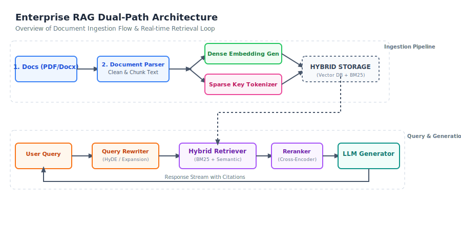
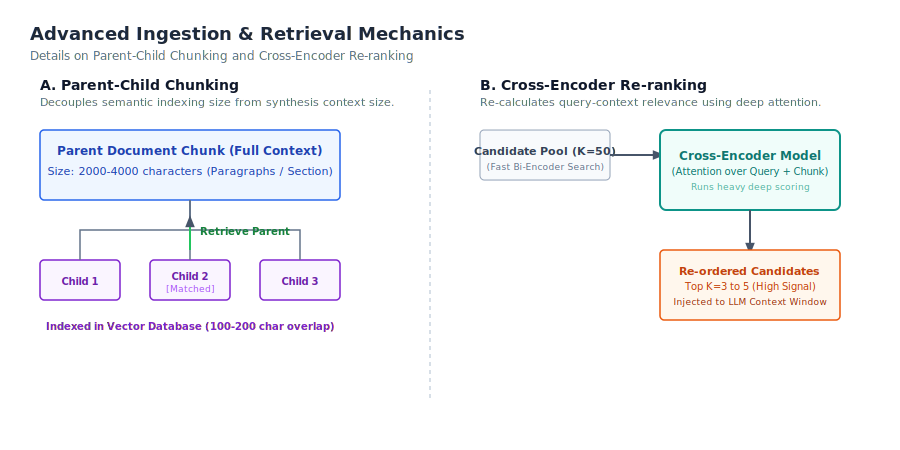

# Designing Enterprise Retrieval-Augmented Generation Systems

*A Technical Research Report written by a CS Bachelor Student who has spent way too many nights studying ingestion topologies, database latency, and how to stop LLMs from hallucinating on university assignments.*

---

## Intro: Why RAG is the Hottest Topic Right Now

Honestly, if you look at the AI space today, Retrieval-Augmented Generation (RAG) is pretty much everywhere. Everyone wants to put an LLM on their private documents. But let’s be very honest: building a basic RAG system for a uni project or hackathon is super easy—you just spin up LangChain, dump some PDFs in a folder, and boom, you have a chat assistant. 

But when you try to scale this for a real enterprise (like during my internship, or for a proper Final Year Project - FYP), things start breaking. You have to deal with massive files, strict permissions, latency budgets, and the biggest headache of all: **hallucinations**. 

In this report, I’ll walk you through how real-world enterprise RAG systems are designed, covering everything from chunking and embeddings to hybrid search and re-ranking.

---

## 1. The High-Level Architecture (The Dual-Path Setup)

Basically, a solid enterprise RAG setup is divided into two separate pipelines: the **Ingestion Path** (which is done offline/in batches) and the **Query Path** (which happens in real-time when the user asks a question).


*Figure 1: The dual-path RAG architecture showing the offline ingestion flow and the real-time query-generation loop.*

### Ingestion Path
1. **Parsing**: We read the raw files (PDFs, DOCX, Markdown). Converting messy tables into clean Markdown tables is key here; otherwise, the tables turn into gibberish.
2. **Chunking**: We split the document into smaller text blocks. 
3. **Embeddings & Sparse Tokenizer**: We pass the text chunks through an embedding model (like OpenAI or HuggingFace) to get dense vectors, and we also build a BM25 index for keyword search.
4. **Vector Store**: Finally, we save these vectors and their raw text in our database with custom metadata.

### Query Path
1. **Query Processing**: The user types a question. We might rewrite it (e.g. using HyDE) to make it easier for the database to search.
2. **Hybrid Search**: We query the Vector DB (for semantic match) and the BM25 index (for exact keywords) at the same time.
3. **Rank Fusion (RRF)**: We merge the lists of documents retrieved from both methods.
4. **Re-ranking**: We run a heavy Cross-Encoder model to pick the absolute top 3-5 documents.
5. **LLM Generation**: We inject these documents into the prompt and send it to the LLM (like Llama 3 on Groq or OpenAI) to get the final grounded response.

---

## 2. Ingestion Strategy: Chunking & Embeddings

This is where the magic starts. If your data parsing and chunking is bad, your RAG system will be useless because the retriever won't find the right information.

### 2.1 Chunking Heuristics (Avoiding the "Cut-off" Problem)
If you do a simple fixed-size character split, you'll end up cutting sentences right in the middle, which destroys the context. 

To solve this, we use two smart techniques:
* **Semantic Chunking**: Instead of characters, we split by sentences. We check the embedding similarity between consecutive sentences. If the similarity drops, it means the topic has changed, so we start a new chunk.
* **Parent-Child Chunking**: This is a great *jugaad* (clever workaround). We split the document into large parent chunks (e.g. 2000 characters) and then divide those into smaller child chunks (e.g. 200 characters). We only embed the child chunks. When a child matches the query, we retrieve its entire parent chunk and feed that to the LLM. This gives the LLM the full context while keeping the search highly precise!


*Figure 2: Parent-Child chunking relation and the Cross-Encoder re-ranking pipeline.*

### 2.2 Embedding Models: API vs Local
- **API Models (OpenAI/Gemini)**: Super high quality, support Matryoshka compression (meaning you can shrink 1536 dimensions to 256 to save database space), but they cost money.
- **Local Models (HuggingFace/all-MiniLM)**: 100% free, runs on your own hardware, but you might need a decent GPU if you're processing thousands of pages.

---

## 3. Retrieval & Vector Databases: Getting the Right Context

### 3.1 Choosing the Database
For small local apps, **FAISS** or **ChromaDB** are excellent and take only minutes to set up. But for large enterprise setups, you need databases like **pgvector**, **Pinecone**, or **Milvus** that support **HNSW indexes** (for fast graph-based vector search) and pre-filtering.

### 3.2 Pre-Filtering vs Post-Filtering (Security Constraint)
> [!IMPORTANT]
> If your enterprise RAG has files with different user permissions, you **must** use pre-filtering. 
> * **Post-Filtering**: Runs the vector search first, gets top 50, and then removes documents the user shouldn't see. If all top 50 are restricted, the user gets 0 results!
> * **Pre-Filtering**: Filters out unauthorized files *first* at the index level, and then runs the vector search on the remaining allowed documents, ensuring the user always gets their results.

### 3.3 Hybrid Search & Reciprocal Rank Fusion (RRF)
To get the best of both worlds, we combine:
1. **BM25 Search**: Excellent for exact codes, model numbers, or names.
2. **Dense Vector Search**: Excellent for synonyms and conceptual questions.

We merge their ranks using **RRF**, which gives a combined score to each document:
\[RRF\_Score = \sum \frac{1}{60 + Rank}\]
After RRF, we pass the top results through a **Cross-Encoder Reranker** (like `bge-reranker-large`). Bi-encoders are fast but can be shallow. Cross-encoders look at the query and document together, recalculating attention to make sure the absolute best match is ranked #1.

---

## 4. Prompt Engineering & Conversational Memory

### 4.1 Prompt Design
You have to tell the LLM to behave, otherwise it will try to be smart and hallucinate. Here is the template I found works best for assignments and projects:

```
[System Instructions]
You are a factual assistant. Answer the user's query using ONLY the source passages provided. If you don't know the answer, say "I cannot find the answer in the uploaded documents." Do not make up facts. Cite source numbers like [1], [2].

[Context Blocks]
--- SOURCE 1: specs.txt ---
Engine G2 is built with titanium alloys.

[User Query]
What material is the G2 engine built with?
```

### 4.2 Handling Chat History (Memory)
If the user asks follow-up questions, we can't just dump all previous messages into the prompt, or we'll run out of tokens (and API credits!). Instead, we use:
- **Sliding Window**: Keep only the last 3-4 exchanges.
- **Summary Memory**: Use an LLM to generate a running summary of older messages while keeping the most recent exchanges verbatim.

---

## 5. Hallucination Reduction: Keeping the LLM in Check

Hallucination is the biggest blocker for real-world RAG systems. To verify and evaluate our pipeline, we use the **RAG Triad of Evaluation**:

1. **Context Relevance**: Did the retriever fetch the right documents? Or did it fetch noise?
2. **Groundedness**: Is the LLM's answer based *only* on the retrieved documents? Or did it make stuff up?
3. **Answer Relevance**: Did the LLM actually answer the user's question?

### Guardrails
We also use **Natural Language Inference (NLI)** filters. Before showing the response to the user, a smaller model checks if the response is supported by the context. If it isn't, we drop the response and show a fallback message.

---

## 6. Future Trends: What's Next in RAG?

* **GraphRAG**: Combining vector databases with Knowledge Graphs. This is huge because it allows the RAG system to answer global queries like "What are the common issues across all project reports?" instead of just searching for specific keywords.
* **Agentic RAG**: Giving the RAG system an agent planner (using frameworks like LangGraph). The agent can decide to search the database, search the web, ask follow-up questions, or call APIs before giving the final answer.
* **Speculative RAG**: Drafting the answer using a tiny local model, and then using a large LLM to check and refine the draft, saving computing costs and latency.
